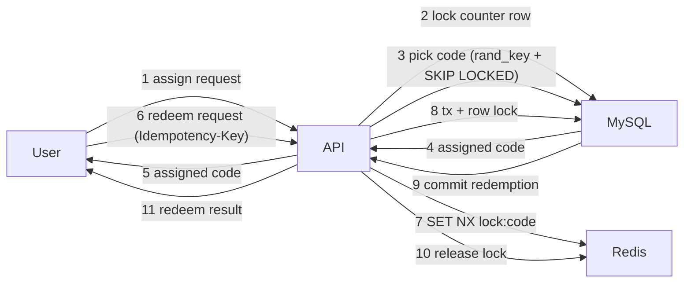
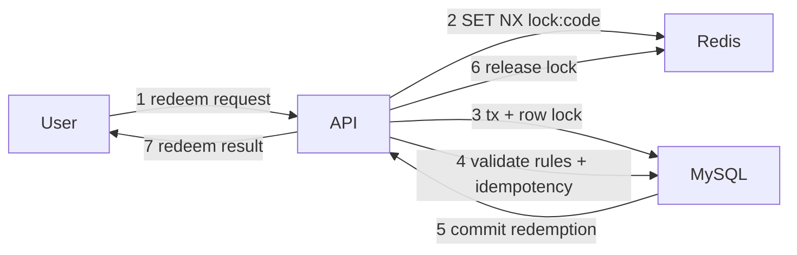

# Coupon assignment and redemption flow

- Goal: assign an available coupon code and redeem it safely under retries.
- Actors: User, API, Redis, MySQL.
- Preconditions:
  - Coupon book is ACTIVE.
  - Codes exist in AVAILABLE state.
  - User is authenticated and scoped to a business.
- Steps (assignment):
  - User requests assignment for a coupon book.
  - API locks the (book_id, user_id) counter row in MySQL and checks limits.
  - API selects a code using rand_key pivot + `FOR UPDATE SKIP LOCKED`.
  - API marks the code as ASSIGNED and increments the counter.
- Steps (redemption):
  - User requests lock/redeem with Idempotency-Key.
  - API acquires Redis lock on `lock:code:{codeId}`.
  - API opens a MySQL transaction and locks the code row.
  - API validates assignment + lock token; inserts redemption with unique
    idempotency key.
  - API commits, clears lock fields, and releases Redis lock.
- Postconditions:
  - Assignment counts are consistent.
  - Redemption is recorded once; retries return the same result.
- Related playbook: docs/feature-playbooks.md
- Related contracts: docs/contracts.md

## Tables involved (quick view)
coupon_book_user_counters
- coupon_book_id
- user_id
- assigned_count
- redeemed_count
- created_at
- updated_at

coupon_codes
- id
- coupon_book_id
- code
- state (AVAILABLE|ASSIGNED|LOCKED)
- assigned_to_user_id
- assigned_at
- lock_token
- lock_expires_at
- created_at
- updated_at

redemptions
- id
- coupon_book_id
- coupon_code_id
- user_id
- status (SUCCEEDED|FAILED)
- idempotency_key
- created_at

## Diagram (annotated)


## Step commentary
- 1) User requests assignment for a coupon book.
- 2) API locks the (book_id, user_id) counter row to serialize limit checks.
- 3) API selects a random available code using a rand_key pivot and skips
  locked rows to avoid waiting on a busy code.
- 4) MySQL returns the selected code; the API marks it ASSIGNED in the same
  transaction.
- 5) User receives the assigned code (or a reference to it).
- 6) User calls redeem with an Idempotency-Key to make retries safe.
- 7) API acquires a short Redis lock to avoid concurrent redemptions on the
  same code.
- 8) API opens a transaction and locks the code row to validate assignment,
  lock token, and business rules.
- 9) MySQL records the redemption with unique constraints and commits.
- 10) API releases the Redis lock (best-effort).
- 11) User receives the redemption result; retries return the same result.

## Assignment timeline (locks and counter)
- T1: Begin DB transaction.
- T2: Lock counter row (book_id, user_id) with `FOR UPDATE`.
- T3: Validate `assigned_count + quantity <= max_codes_per_user`.
- T4: Select code with rand_key pivot + `SKIP LOCKED`.
- T5: Update code row to ASSIGNED.
- T6: Increment counter row `assigned_count += assigned.length`.
- T7: Commit transaction (releases DB locks).

## Row examples (before/after)
Assume:
- coupon_book_id = "book-1"
- user_id = "user-9"
- code_id = "code-7" with code "MT-1A2B3C4D"

Counter row (before assignment):

| coupon_book_id | user_id | assigned_count | redeemed_count |
| --- | --- | --- | --- |
| book-1 | user-9 | 0 | 0 |

Counter row (after assignment of 1 code):

| coupon_book_id | user_id | assigned_count | redeemed_count |
| --- | --- | --- | --- |
| book-1 | user-9 | 1 | 0 |

Coupon code row (before assignment):

| id | coupon_book_id | code | state | assigned_to_user_id |
| --- | --- | --- | --- | --- |
| code-7 | book-1 | MT-1A2B3C4D | AVAILABLE | null |

Coupon code row (after assignment):

| id | coupon_book_id | code | state | assigned_to_user_id |
| --- | --- | --- | --- | --- |
| code-7 | book-1 | MT-1A2B3C4D | ASSIGNED | user-9 |

Redemption row (after successful redeem):

| coupon_book_id | coupon_code_id | user_id | status | idempotency_key |
| --- | --- | --- | --- | --- |
| book-1 | code-7 | user-9 | SUCCEEDED | idem-123 |

## Diagram (redemption focus)


## Why each redemption step exists
- 1) Entry point for the canje attempt and its Idempotency-Key.
- 2) Fast contention guard so parallel requests do not both proceed.
- 3) Row lock keeps the assigned code consistent inside the transaction.
- 4) Business rules + idempotency guarantee correct outcomes on retries.
- 5) Commit makes redemption durable and enforces DB constraints.
- 6) Release Redis lock so future requests can proceed.
- 7) Return the same result for retries (idempotent behavior).

## Manual validation (stage checkpoint)
- Preconditions:
  - API running with LOG_DETAIL_LEVEL=3.
  - MySQL and Redis are up.
  - Coupon book is ACTIVE and codes are AVAILABLE.
- Seed data (example SQL):
  ```sql
  INSERT INTO coupon_books
    (id, business_id, name, description, status, reusable_per_user, max_codes_per_user, max_redemptions_per_user)
  VALUES
    ('book-00000000-0000-0000-0000-000000000001', 'biz-1', 'Manual Test Book', 'Seeded for manual test', 'ACTIVE', 0, 1, 1);

  INSERT INTO coupon_codes
    (id, coupon_book_id, code, state, rand_key)
  VALUES
    ('code-00000000-0000-0000-0000-000000000001', 'book-00000000-0000-0000-0000-000000000001', 'MT-ABC123', 'AVAILABLE', 12345);
  ```
- Assignment request:
  - POST `/v1/coupon-books/{couponBookId}/assignments`
  - Body: `{ "userId": "user-1", "quantity": 1 }`
  - Expect: `assigned[0].codeId` and `assigned[0].code`.
  - Logs (LOG_DETAIL_LEVEL 2/3): "assignment request received",
    "assignment started", "lock counter row", "select available code",
    "transaction committed".
- Lock request:
  - POST `/v1/coupon-books/{couponBookId}/codes/{codeId}/lock`
  - Headers: `Idempotency-Key: lock-1` (contract) and optional `X-Request-Id`.
  - Body: `{ "userId": "user-1", "ttlSeconds": 120, "idempotencyKey": "lock-1" }`
  - Expect: `lockToken`, `lockExpiresAt`.
  - Logs: "lock request received", "acquire redis lock", "lock code row", "lock committed".
- Redeem request:
  - POST `/v1/coupon-books/{couponBookId}/codes/{codeId}/redeem`
  - Headers: `Idempotency-Key: redeem-1` (contract) and optional `X-Request-Id`.
  - Body: `{ "userId": "user-1", "lockToken": "<lockToken>", "idempotencyKey": "redeem-1" }`
  - Expect: `redemptionId` and `status: SUCCEEDED`.
  - Logs: "redeem request received", "open transaction", "insert redemption",
    "redemption committed".
- Retry check:
  - Repeat the redeem request with the same `idempotencyKey`.
  - Expect the same `redemptionId` without duplicate inserts.
