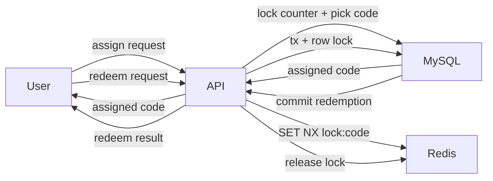

# Coupon assignment and redemption flow

- Goal: assign an available coupon code and redeem it safely under retries.
- Actors: User, API, Redis, MySQL.
- Preconditions:
  - Coupon book is ACTIVE.
  - Codes exist in AVAILABLE state.
  - User is authenticated and scoped to a business.
- Steps (assignment):
  - User requests assignment for a coupon book.
  - API locks the (book_id, user_id) counter row in MySQL and checks limits.
  - API selects a code using rand_key pivot + `FOR UPDATE SKIP LOCKED`.
  - API marks the code as ASSIGNED and increments the counter.
- Steps (redemption):
  - User requests lock/redeem with Idempotency-Key.
  - API acquires Redis lock on `lock:code:{codeId}`.
  - API opens a MySQL transaction and locks the code row.
  - API validates assignment + lock token; inserts redemption with unique
    idempotency key.
  - API commits, clears lock fields, and releases Redis lock.
- Postconditions:
  - Assignment counts are consistent.
  - Redemption is recorded once; retries return the same result.
- Related playbook: docs/feature-playbooks.md
- Related contracts: docs/contracts.md

## Diagram

